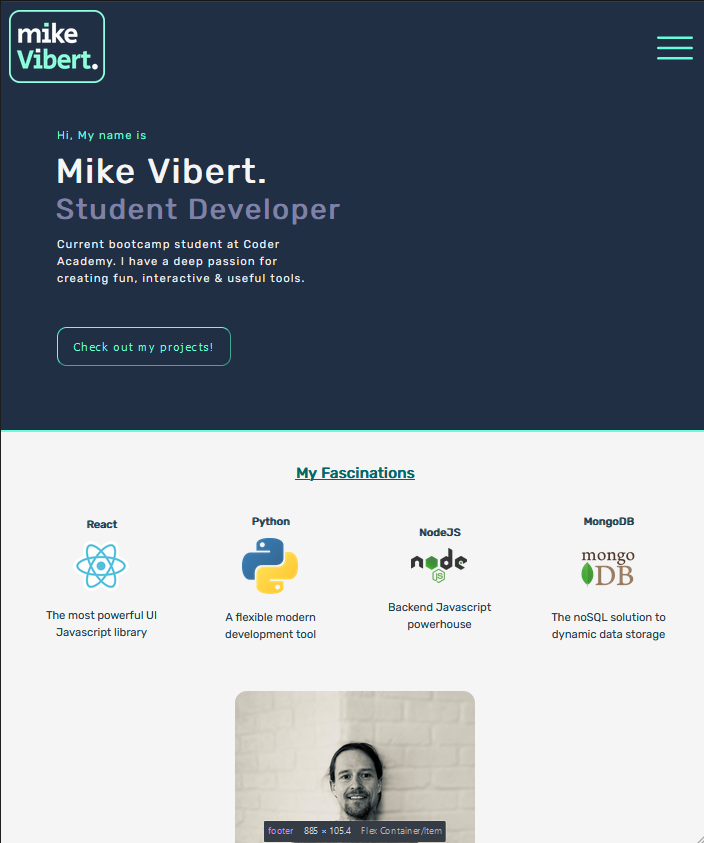
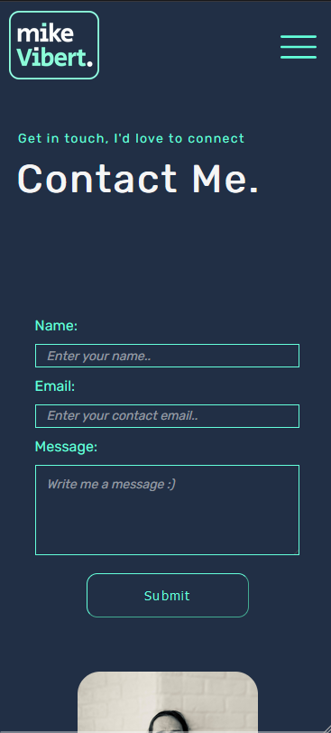
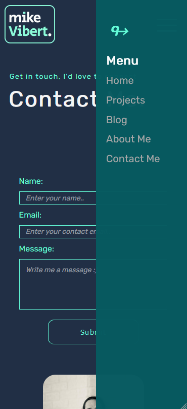
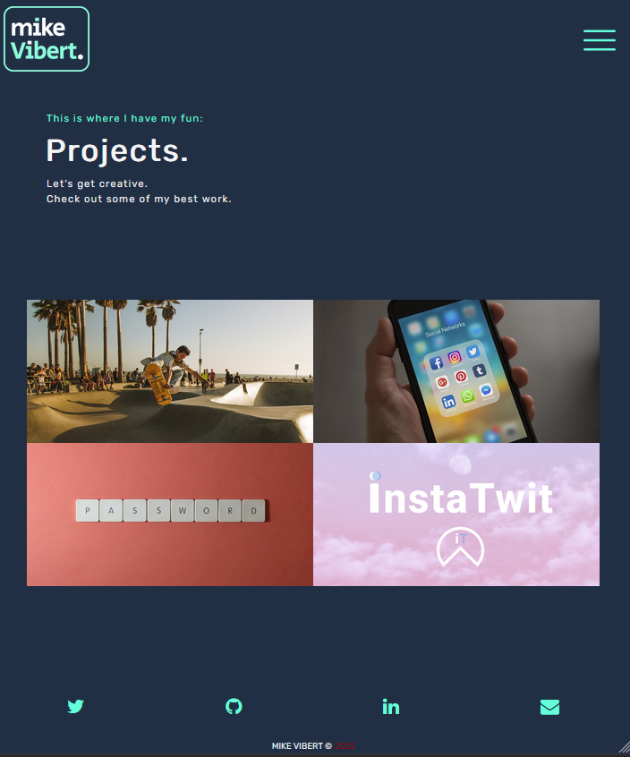
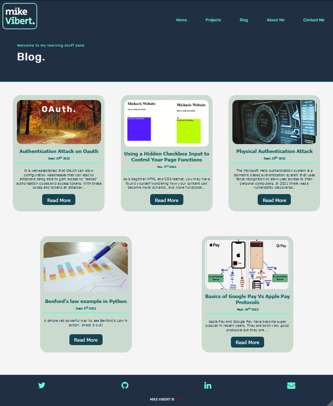

# Mike V. Portfolio 

Live page available: [mikevibert.com](https://www.mikevibert.com)  

Github Repository: [https://github.com/michael-vibert/portfolio](https://github.com/michael-vibert/portfolio) 

Porfolio Presentation: [https://youtu.be/PmU7ETBiKr8](https://youtu.be/PmU7ETBiKr8)

_**Welcome** to my first website design which will act as a base for my professional portfolio. As a full stack web developer in training at Coder Academy, this is my first project that I will be submitting._ 

## Purpose
The general purpose of this project was an attempt to learn the fundamentals of web development with a particular focus on HTML and CSS/SASS. It will also act as a demonstration of what I have learnt so far in the course. With further work, refactoring and a deepening understanding of other fundamentals such as Javascript, this portfolio will also become a tool to help me show potential employers what I am capable of achieving. 

## Design 
This project was developed from the ground up. Starting with an detailed wireframe/mockup creation (seen below) where I put in place what I wanted to attempt to achieve. This gave me a great reference to work towards during the building process. 

I started every page from a mobile first perspective, given that the majority of web traffic is on mobile nowadays and the fact that it is generally less difficult to scale up to larger screens rather than trying to scale down to accommodate smaller ones. 

## Features
Some of the features I included was a full responsive layout and structure that allows this content to look good on any screen size. This includes a navigation menu that starts as a “hamburger menu” at mobile screen sizes, where the nav buttons become available through a sidebar menu when the hamburger is clicked. Which then becomes a normal navigation menu with the links displayed along the top in larger screens. 

I included a projects page (which does not currently link to anything) that has images appropriate to the proposed project, with an overlay that slides up upon hovering over the image. The overlay has text description of the project and a button to link the user to the project. To ensure that it would function on a mobile device, I included a little JQuery code that allows the overlay to remain active upon click as well. 

My blog has 5 posts which were all authored by myself. They all link from the blog post page where it features a blurb about the post and an image to increase awareness of what the porst is about. The posts include cyber security topics and a couple of things that I’ve learnt along my coding journey so far. 

There is a contact me page which has a link to allow the download of a mock resume, it has contact details and also a contact form (which is not currently functional yet).

There also features a short About Me page which introduces the user to my personality, history and interests. 

The website contains the following pages:
1. home/index
2. Contact 
3. About me
4. Projects 
5. Blog - With links to blog pages

## Sitemap

## Screenshots

 

## Tech Stack

- HTML
- CSS
- SASS
- Deployed on Netlify
- Built on VS Code 

Note, there is a very small amount of JS/JQuery included but this was not the focus for this project at this stage at all.  

## Intended Audience:
This project and website is for people who have a thorough knowledge of tech, programming and different programming paradigms. It is particularly aimed at potential clients and employers who may want to engage my professional services in the future. 

## Inspo References
* [https://brittanychiang.com/](https://brittanychiang.com/)
* [http://findmatthew.com/](http://findmatthew.com/)

